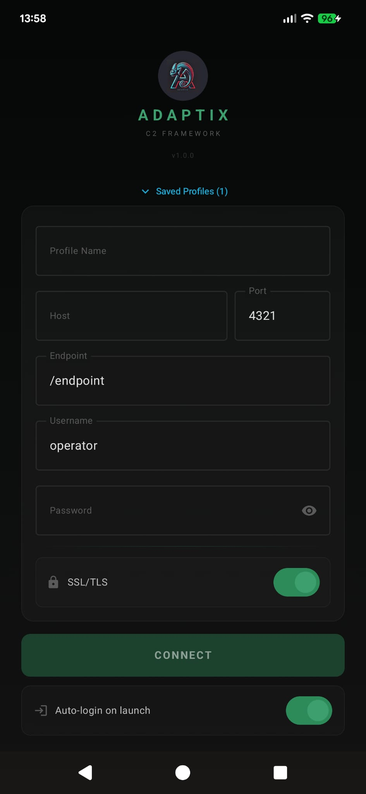
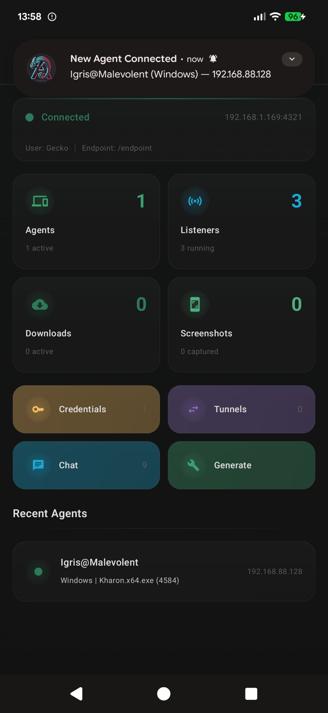
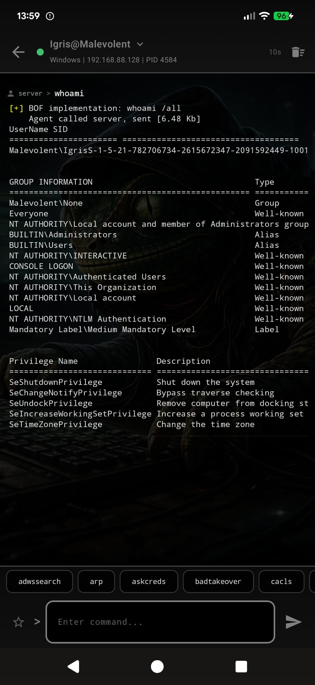

# GeckoDroid

Mobile client for [Adaptix C2 Framework](https://github.com/Adaptix-Framework/AdaptixC2). Full operator access from your Android device.

## What it does

GeckoDroid gives you control over your Adaptix C2 server from anywhere. Instead of sitting at your desktop client, you can manage operations on the go.

**Agents** - See all connected agents with live status indicators. Search, filter by alive/dead, sort by name, OS, or last seen. Tap any agent to open its console.

**Console** - Interactive command shell per agent. Execute commands, see output in real-time as it streams in. Expand the header to see full agent details (PID, process, architecture, domain, sleep interval, first/last seen). Save frequently used commands as favorites for quick access.

**Listeners** - Start and stop listeners. Save listener configurations as profiles so you can spin them up again with one tap.

**Generate** - Build agent payloads. Select agent type, pick listeners, configure options, and generate - all from your phone. Build logs stream in real-time.

**Tunnels** - View all active tunnels with bind/forward addresses. Stop tunnels when you're done.

**Credentials** - Browse all harvested credentials. Search by username, host, realm, or type. Show/hide passwords with one tap. Tap any field to copy to clipboard.

**Screenshots** - Grid gallery of captured screenshots. Tap for full-screen view. Save to your phone's gallery or share directly. Multi-select to bulk delete.

**Downloads** - Track all file downloads from agents. Search by filename or host.

**Chat** - Operator chat room. Coordinate with other operators connected to the same server.

## Security

- Biometric lock - require fingerprint or face unlock to open the app
- Auto-login - authenticate once, connect automatically on launch
- Saved profiles are stored in encrypted preferences
- All server communication over SSL/TLS (configurable)

## Requirements

- Android 13+ (API 33) device or emulator
- An Adaptix C2 server running and accessible from your network
- Server host, port, endpoint, and operator credentials

## Build prerequisites

- **JDK 17** - required by Gradle and the Android build toolchain
- **Android SDK** - with platform API 35 (`compileSdk 35`)
- **Android Studio** - easiest way to get the SDK, or install the command-line tools manually

The project uses Gradle 8.9 (wrapper included), AGP 8.5.2, and Kotlin 1.9.24 - all resolved automatically by Gradle.

## Build

The debug build includes R8 minification and resource shrinking, producing a ~6MB APK instead of ~65MB.

```bash
# Clone and build
git clone https://github.com/BlackSnufkin/GeckoDroid.git && cd GeckoDroid
./gradlew assembleDebug

# Install on connected device
adb install -r app/build/outputs/apk/debug/app-debug.apk
```

If you don't have `adb` in your PATH, it's at `<android-sdk>/platform-tools/adb`.

## License

This project is licensed under the [GNU General Public License v3.0](LICENSE).

## Getting started

1. Open GeckoDroid
2. Enter your server details (host, port, endpoint)
3. Enter your operator username and password
4. Enable SSL if your server uses HTTPS
5. Tap **CONNECT**

Save the profile and enable auto-login to skip this step next time. Enable biometric lock to protect the app when you're not using it.


## Screenshots

<p align="center">
  
  
  
</p>